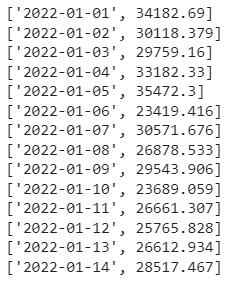
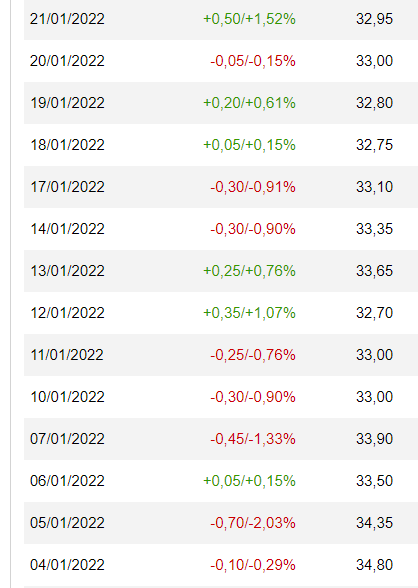

<h1>Report on the project from 13th - 19th Feb 2023</h1>

What I've done:

<h2 style="color:green">Adjust Prediction Price Experiment</h2>
<b>I.Result</b>

Disclaimer: The expriment did not go too well

<figure>
    
    <figcaption><i>Predicted Open prices begin on 31-12-2021</i></figcaption>
</figure>

The image above is showing the prices of the next 2 weeks predicted by my LSTM model and on the left is the corresponding date. Now, take a look at the image below:

<figure>
    
    <figcaption><i>Real prices begin on 31-12-2021</i></figcaption>
</figure>

The image above is showing the real open prices of ACB begin from 31-12-2021.

<b>II.Insights</b>

Done showing results, I would like to share some insights

<ul>
    <li>The model shows that most predictions are smaller than the actual prices.</li>
    <li>The news can be used to increase the predictions</li>
</ul>
<b>III.New Problems</b>
<ul>
    <li>We need a model that takes the date as an input and output an array of predicted prices.</li>
    <li>Do we need a model for each company.</li>
    <li>A place to store the news seperated by the company</li>
</ul>